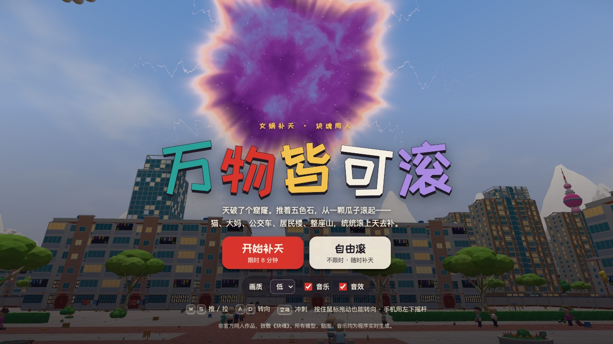
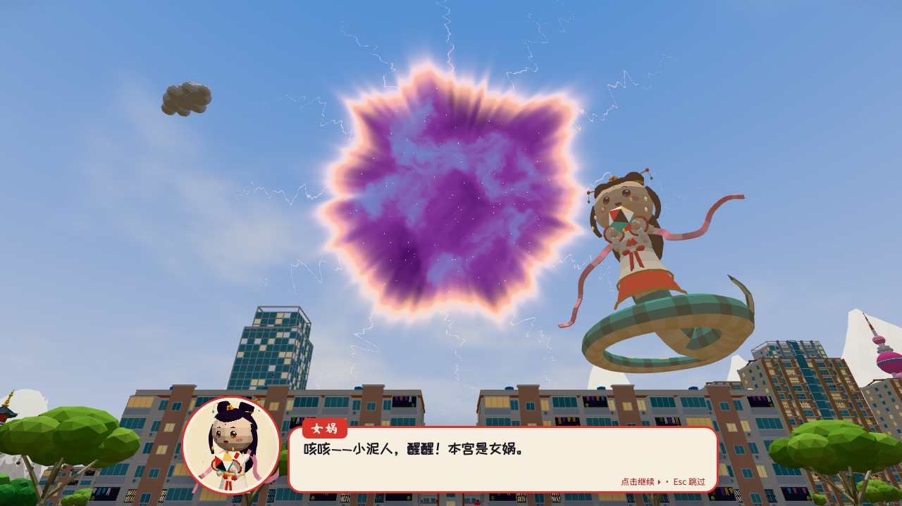
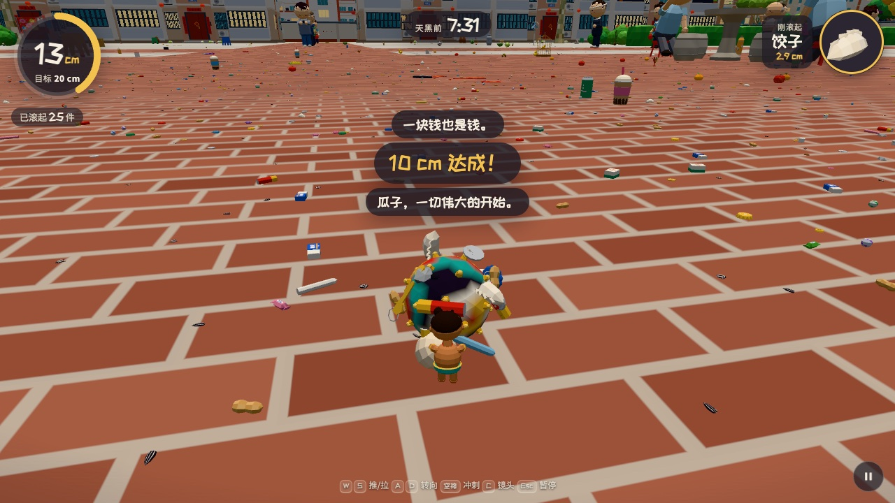
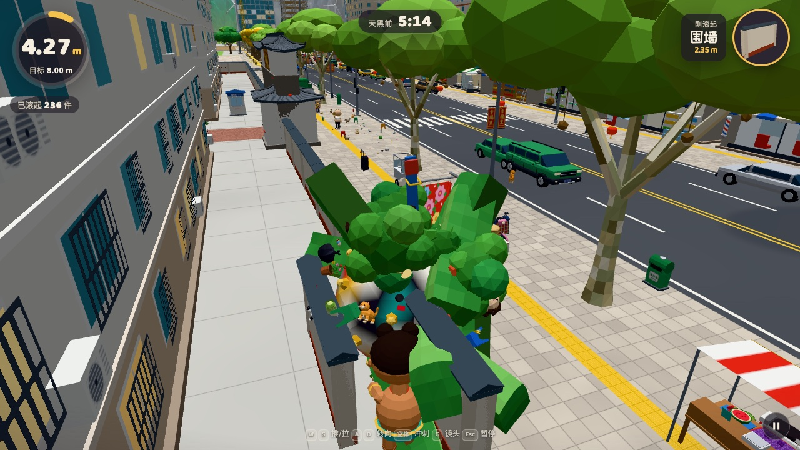
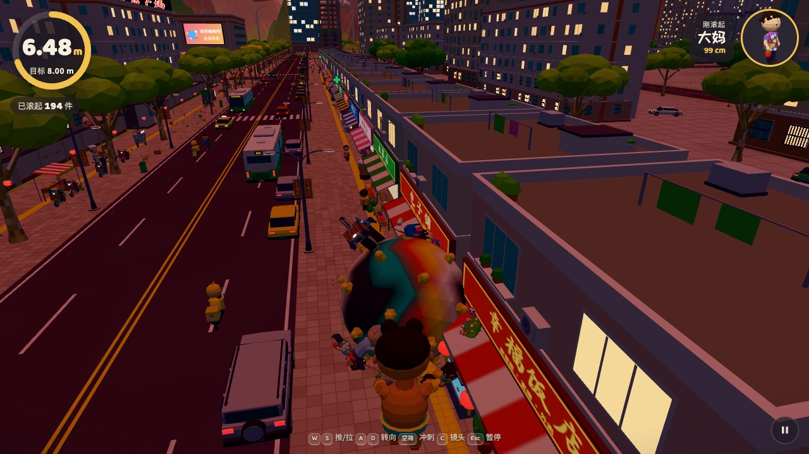
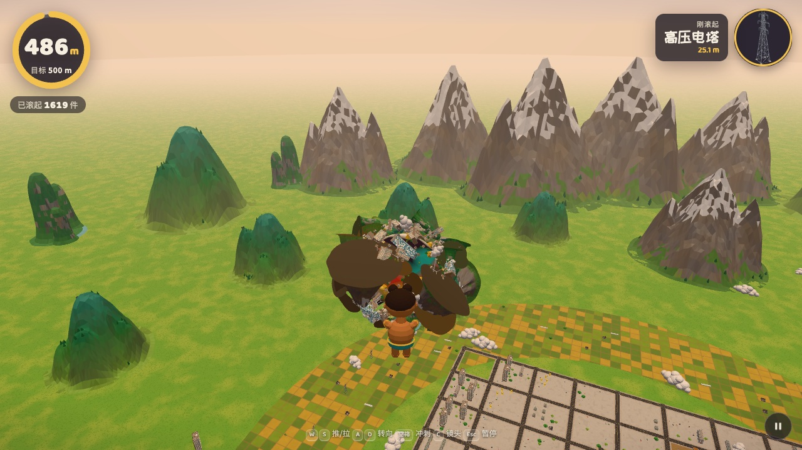

# 万物皆可滚 · 女娲补天

女娲补天 ×《块魂》的同人 3D 网页小游戏。

女娲炼五色石炼嗨了，一锤子把天捅了个窟窿。你是她捏的小泥人，推着一颗 6 厘米的五色石，从瓜子、麻将牌滚起——猫、广场舞大妈、外卖小哥、公交车、居民楼、明珠塔、高铁，最后连山带云一起滚上天，去把窟窿补上。

**在线试玩：<https://superdiaodiao.github.io/wanwu-gun/>**

也可以直接下载仓库根目录的 [`index.html`](index.html)，用 Chrome / Edge / Safari 双击打开就能玩。

| | |
|---|---|
|  |  |
|  |  |
|  |  |

## 怎么玩

- <kbd>W</kbd><kbd>A</kbd><kbd>S</kbd><kbd>D</kbd>（或方向键）往屏幕上哪个方向按，球就往哪滚，镜头会慢慢转到球后面；往回按是掉头，镜头跟着转过来。<kbd>空格</kbd> 冲刺，<kbd>C</kbd> 切镜头，<kbd>Esc</kbd> 暂停，按住鼠标拖动转镜头。
- 手机上用左半边屏幕当摇杆，往哪推球就往哪滚，往回拉会掉头；右边的「冲」是冲刺。附近值得吃的东西会闪金光。画面卡的话会自动降低分辨率，也可以在开始页把「画质」调成低。
- 比球小的东西一碰就粘上，球随之长大；比球大的会把你弹开——撞一下会提示还差多少，等长大了再来。撞得太猛会掉东西。
- **限时补天**：8 分钟，从上午滚到天黑。时间一到，球飞上天去补窟窿，女娲按大小给你封称号（小泥丸 → 泥球 → 石球 → 巨石 → 补天石 → 五色神石 → 开天辟地）。
- **自由滚**：不限时，按 Esc 可以随时去补天。

一些值得去找的东西：把广场舞音箱滚走，整个广场会安静下来；大爷们在石桌边下棋、在公园打太极；人和动物发现你能吃掉它们时会尖叫着逃跑；汽车会冲你按喇叭；城外有高铁、风车和桂林山水。

## 技术要点

- **单个 HTML 文件（约 1.1 MB），没有任何图片、模型或音频文件。** 238 种模型全部由代码拼出低多边形，文字和图案用 Canvas 现画进一张图集，音乐和音效用 Web Audio 实时合成（原创五声音阶配乐，古筝用 Karplus–Strong 拨弦算法）。
- three.js r186 + esbuild 打包内联；所有物件按类型实例化渲染，每帧逐个做视锥和距离剔除（越小的东西画得越近），远处自动换成去掉细节的低面数版本，阴影只画球附近的。
- 对数深度缓冲 + 随球大小缩放的镜头、阴影和雾：同一个世界里从 1 厘米的瓜子到几百米的山都能看清。
- 成长速度有上限（每秒最多长大约 1.6–3%），滚雪球越滚越快但不会一下失控；物件粘在球面上随球一起长大，旧的太小了才会被“吃进去”。

## 本地构建

```bash
npm install
npm run build         # 构建单文件 dist/index.html，并复制到仓库根目录的 index.html
npm run dev           # 不压缩的开发版，改代码自动重建
npm run gallery       # 模型图鉴：dist/gallery.html（?filter=cat 只看某类）
```

## 目录

| 路径 | 内容 |
|---|---|
| `src/main.js` | 启动、游戏状态、主循环、结尾演出 |
| `src/game/` | 球的物理与成长、镜头、输入、地图布局、会动的东西、天空、地面、HUD、对话 |
| `src/catalog/` | 全部模型（小物件、家居、人和动物、街道、车辆、建筑、自然） |
| `src/core/` | 程序化建模工具、贴图图集、共享材质 |
| `src/audio/` | 合成器、乐器、配乐、音效 |
| `docs/CATALOG_GUIDE.md` | 建模规范（坐标约定、API、风格、面数预算） |

## 说明

非官方同人作品，致敬《块魂》（塊魂 / Katamari Damacy），不包含原作的任何素材。整个项目由 Claude Code（Claude Opus 5.5）根据一句话需求完成设计、编码与测试。
